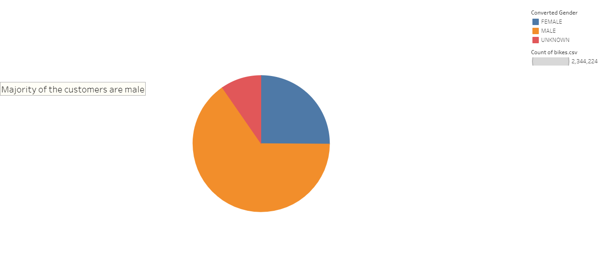

# Bikesharing

## Overview
The purpose of the challenge was to develop a story on how bike data from New York City can be used as a case for starting a bike-sharing program in Des Moines, Iowa. This challenge requires the use of a data visualization software called Tableau. We are using the data to tell a story and make our pitch to investors. 

## Results
Using tableau, the following charts were made:

| Customer gender breakdown | Customer status |
| :---: | :---: |
| |  |

| Peak hours of operation | Trip Duration |
| :---: | :---: |
| |  |

| Checkout time by gender | Trip breakdown by usertype and gender |
| :---: | :---: |
| |  |

| Trips on a daily basis | Trips by gender |
| :---: | :---: |
| |  |

See the link below for the charts and storyline on how a bike sharing program can use started in Des Moines, Iowa.

[Link to dashboard](https://public.tableau.com/app/profile/sue1775/viz/CitibikeChallenge_16486801845130/AcaseforbikesinDesMoines)

## Summary

Overall, the data points to many subscribers using the bikes on a regular basis. Male customers who are subscribers used it as their daily commute. On another note, it would be wise to survey the population in Des Moines to see if male customers would be interested in the bike-sharing program. 

Here are additional visualizations to consider: 
- Top starting and ending points with bike utilization data
- Peak Hour of operation breakdown by gender
